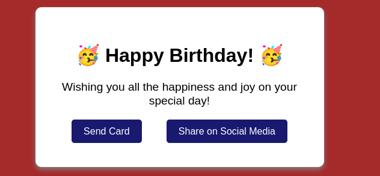

# fcc-greeting-card
# 🎂 Carte d'Anniversaire Interactive (Birthday Card Project)

Une carte de vœux moderne, interactive et entièrement accessible, réalisée en HTML et CSS dans le cadre de ma formation.

## 🚀 Fonctionnalités & Interactions
* **Design Responsive & Moderne :** Une carte épurée avec des effets d'ombrage (`box-shadow`) pour un rendu réaliste.
* **Interactivité au Survol (`:hover`) :** Transformations fluides et inclinaisons dynamiques (`skewX`) lors de l'interaction avec l'utilisateur.
* **Accessibilité au Clavier (`:focus`) :** Navigation entièrement gérée à la touche Tab avec des contours visuels personnalisés (`outline`) pour les utilisateurs sans souris.
* **Animations CSS :** Boutons animés avec gestion des états (utilisation des propriétés `transform`, `scale` et `transition`).

## 🛠️ Technologies utilisées
* **HTML5 :** Structure sémantique de la carte.
* **CSS3 :** Flexbox (pour le centrage), Pseudo-classes (`:hover`, `:focus`, `:checked`), Pseudo-éléments (`::before`, `::after`), et Propriétés de transition/transformation.

## 📸 Aperçu

## Live demo 

https://cedricboucard.github.io/fcc-greeting-card/